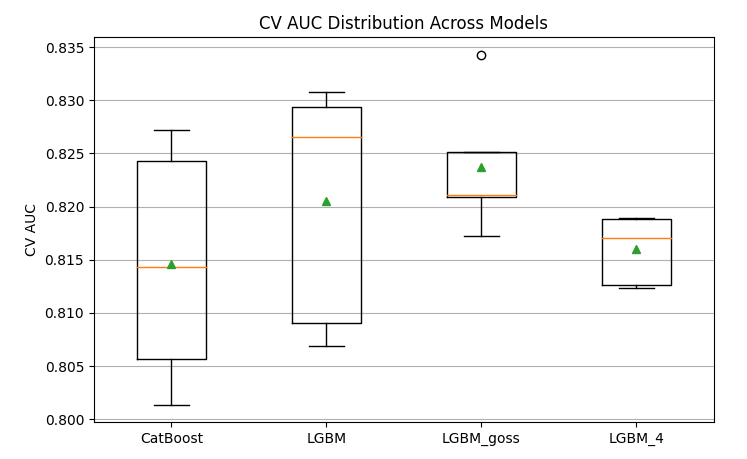
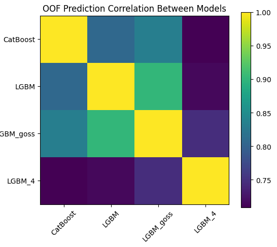

# kaggle home credit competition

<i>I (Kaixuan Chen) won a bronze medal!</i>

## Overview

This project is based on the **[Home Credit Default Risk – Stability Competition](https://www.kaggle.com/competitions/home-credit-credit-risk-model-stability/overview)** on Kaggle, which focuses on predicting loan repayment capabilities for clients with limited credit history. The main challenge of the competition is not only achieving strong predictive performance (AUC), but also ensuring model stability over time. 

Submissions are evaluated using a **gini stability metric**, where weekly Gini scores are computed and a linear regression is fitted across time to penalize performance degradation and excessive variability. This design explicitly enforces a trade-off between predictive power and long-term stability, which is critical for real-world consumer finance applications.

By balancing model performance and robustness, this competition aims to help consumer finance providers expand responsible lending and improve financial inclusion for underserved populations.  
**In this competition, I (Chen Kaixuan) achieved a Bronze Medal**, ranking among the top-performing solutions.

# Data

For detailed information about the dataset, please refer to  
[Home Credit – Credit Risk Model Stability (Kaggle)](https://www.kaggle.com/competitions/home-credit-credit-risk-model-stability/data)

Our data processing pipeline has two key highlights:

### 1. Memory Optimization
To reduce memory usage, we downcast data types to the smallest possible formats without losing precision.  
For example, numerical columns are converted from `int64` to `int32` wherever applicable.  
This strategy lowers the overall memory footprint of the dataset.

### 2. Aggregation for Historical Records (depth > 0)
For features with `depth > 0`, historical records associated with each `case_id` need to be condensed into a single representation.  
We apply aggregation functions—**maximum (max)**, **mean**, and **variance (var)**—to summarize these historical features effectively.

### Results
Through the above optimizations and aggregations:

- **Memory usage of dataframe `df_train`** was reduced from **4711.2195 MB** to **2665.6302 MB**
- **Final training data shape**: (1,526,659, 472)

# Model

We apply 5-fold cross-validation during model training.  
To introduce parameter diversity across folds, different parameter sets are used based on the fold index:

- **Even-numbered folds use `params2`**
- **Odd-numbered folds use `params1`**
 
In addition to this alternating LightGBM setup, **CatBoost**, **LightGBM with `params_3`**, and **LightGBM with `params_4`** are trained using their respective configurations consistently across all folds without parameter switching. After training, predictions from all 20 models (4 models plus five folds) are aggregated using **soft voting**, where the final prediction is obtained by averaging the predicted probabilities. The `params1` and `params2` models serve as the primary learners, alternating learning rates to provide additional flexibility. The GOSS-based LightGBM model focuses on samples with large gradients, while the `params4` model explicitly handles class imbalance. CatBoost provides a complementary boosting implementation and tree construction strategy.

---

### LightGBM Parameter Sets

| Parameter | params1 | params2 | Description |
|---------|--------|--------|-------------|
| boosting_type | gbdt | gbdt | Gradient Boosting Decision Tree as the boosting framework |
| colsample_bynode | 0.8 | 0.8 | Fraction of features randomly sampled at each tree node to reduce overfitting |
| colsample_bytree | 0.8 | 0.8 | Fraction of features randomly sampled for each tree |
| device | device | device | Training device (e.g., CPU or GPU) |
| extra_trees | True | True | Enables Extremely Randomized Trees to introduce additional randomness |
| learning_rate | 0.05 | 0.03 | Step size shrinkage controlling the contribution of each tree |
| l1_regularization | 0.1 | 0.1 | L1 regularization term for sparsity and overfitting control |
| l2_regularization | 10 | 10 | L2 regularization term to constrain model complexity |
| max_depth | 20 | 16 | Maximum depth of individual trees |
| metric | auc | auc | Evaluation metric using Area Under the ROC Curve |
| n_estimators | 1500 | 1500 | Number of boosting iterations (trees) |
| num_leaves | 64 | 54 | Maximum number of leaves in each tree |
| objective | binary | binary | Objective function for binary classification |
| random_state | 42 | 42 | Random seed for reproducibility |
| verbose | -1 | -1 | Suppresses training logs |

| Parameter | params_3 | params_4 | Description |
|---------|---------|---------|-------------|
| boosting_type | goss | gbdt | Boosting method: GOSS (Gradient-based One-Side Sampling) focuses on large gradients for efficiency; GBDT is standard gradient boosting |
| colsample_bynode | 0.8 | 0.8 | Fraction of features sampled at each tree node |
| colsample_bytree | 0.8 | 0.8 | Fraction of features sampled for each tree |
| device | device | device | Training device (CPU or GPU) |
| extra_trees | True | True | Enables Extremely Randomized Trees to increase randomness |
| learning_rate | 0.03 | 0.05 | Learning rate controlling the contribution of each tree |
| l1_regularization | 0.1 | 0.1 | L1 regularization to encourage sparsity |
| l2_regularization | 10 | 10 | L2 regularization to reduce overfitting |
| max_depth | 16 | 20 | Maximum depth of trees |
| metric | auc | auc | Evaluation metric using AUC |
| n_estimators | 3000 | 2000 | Number of boosting iterations |
| num_leaves | 54 | 64 | Maximum number of leaves per tree |
| objective | binary | binary | Binary classification objective |
| random_state | 42 | 42 | Random seed for reproducibility |
| verbose | -1 | -1 | Suppresses training logs |
| is_unbalance | — | True | Automatically handles class imbalance by adjusting weights |

---

### CatBoost Classifier Configuration

| Parameter | Value | Description |
|---------|-------|-------------|
| best_model_min_trees | 700 | Minimum number of trees before selecting the best model |
| boosting_type | Plain | Standard boosting scheme without ordered boosting |
| eval_metric | AUC | Evaluation metric based on Area Under the ROC Curve |
| iterations | est_cnt | Total number of boosting iterations |
| learning_rate | 0.05 | Learning rate controlling step size |
| l2_leaf_reg | 10 | L2 regularization coefficient for leaf values |
| max_leaves | 64 | Maximum number of leaves in each tree |
| random_seed | 42 | Random seed for reproducibility |
| task_type | GPU | Training is performed on GPU |
| use_best_model | True | Retains the best-performing model based on validation results |

# Evaluation

The model is evaluated using a Gini score. For each `WEEK_NUM`, the AUC is computed based on the model predictions and converted to a Gini score using the formula:  **Gini = 2 × AUC − 1**.

All models achieved an AUC greater than 0.80 during 5-fold cross-validation, demonstrating strong baseline performance. **LightGBM with GOSS** achieved the best trade-off between average performance and temporal stability, although it exhibited one outlier fold. The **LightGBM models using `params1` and `params2`** showed a higher performance ceiling but also suffered from greater variance across folds. **CatBoost** offered moderate stability with slightly lower overall performance, contributing useful diversity to the ensemble. **LightGBM with `params4`** emerged as the most stable model across folds, though its upper-bound performance was more limited compared to others.

Based on the OOF (out-of-fold) prediction correlation analysis, LGBM_4 exhibits the lowest correlation with all other models, following CatBoost, indicating that ihese models captures substantially different patterns in the data.
